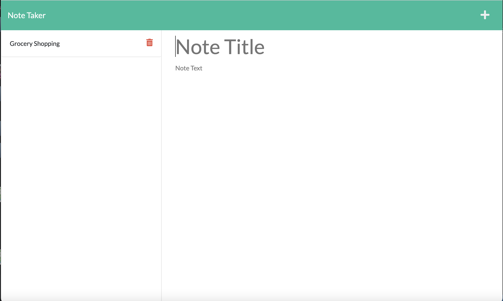

# Note Taker

Simple note taking app used to write, save, and delete notes. 
Uses Express.js and saves and retrieves note data from a JSON file.


## 🔗 Links
[](https://aleenaalexia.github.io/AAJ.Portfolio/)
[](https://www.linkedin.com/in/aleena-johns-24706a1aa/)


## Screenshots




## Installation

Install project with npm

```bash
  npm install 
  npm run start
```
    
## License

[MIT](https://choosealicense.com/licenses/mit/)


## Github Repo

https://github.com/aleenaalexia/Note-Taker
## Deployed Application

https://aleena-note-taker.herokuapp.com/notes
## Authors

- [@aleenaalexia](https://github.com/aleenaalexia)

